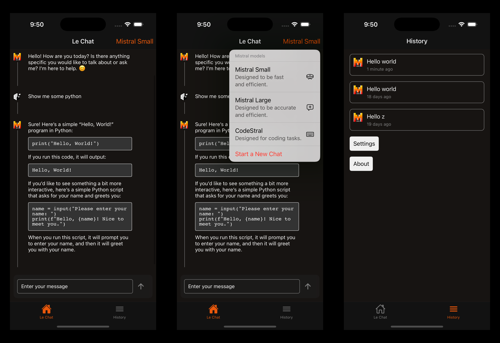

# Mistral Expo Bot

This is a simple hello world project I did in order to train myself with React Native / Expo

# Features

* Chat with various Mistral models.
* Polished chat interface.
* Automaticallu save chat history.
* Restore chat context.

# How to build & run

Search for `YOUR_PAY_KEY_HERE` and replace it with your own Mistral API KEY.

Then in the folder, run `expo run:ios`
